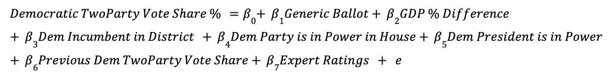

```{r libraries, include = FALSE}
# hide stuff
knitr::opts_chunk$set(echo = FALSE)

# libraries
library(tidyverse)
library(ggplot2)
library(blogdown)
library(stargazer)
library(readr)
library(lubridate)
library(rmapshaper)
library(sf)
library(janitor)
library(leaflet)
library(stringr)
library(ggthemes)
library(gridExtra)
library(plm)
library(usdata)
library(ggrepel)
library(usmap)
library(tigris)
```

```{r data, include = FALSE}
# data
df <- read_csv("district_model_data.csv")
expert_ratings <- read_csv("expert_rating.csv")
df_2022 <- read_csv("df_2022.csv")
state_dists <- unique(read_csv("turnout_2012_2020.csv")$st_cd_fips)
party_power <- read_csv("party_power.csv") %>%
  clean_names()
vote_share <- read_csv("house nationwide vote and seat share by party 1948-2020.csv")
```

```{r cleaning code v.1, include = FALSE}
# party_power$house_party_in_power_at_election <- case_when(
    # party_power$house_party_in_power_at_election == "R" ~ 0,
    # party_power$house_party_in_power_at_election == "D" ~ 1,
  # )
# party_power$pres_party_in_power_at_election <- case_when(
    # party_power$pres_party_in_power_at_election == "R" ~ 0,
    # party_power$pres_party_in_power_at_election == "D" ~ 1,
  # )

# prev_results <- df %>%
  # mutate(year = year + 4) %>%
  # rename(prev_results_dist = DemVotesMajorPercent,
         # prev_diff_dist = national_diff) %>%
  # select(year, st_cd_fips, prev_results_dist, prev_diff_dist)

# df <- df %>%
  # left_join(party_power, by = "year") %>%
  # left_join(prev_results, by = c("year", "st_cd_fips"))

# df %>% 
  # group_by(year) %>% 
 #  count()
```

```{r cleaning code v.2, include = FALSE}
# ADDING EXPERT PREDICTIONS
# RENAME DISTRICT_NUM TO DISTRICT FOR EXPERT PREDICTION MERGING
# df <- df %>% 
  # rename(district = district_num)

# EXPERT PREDICTIONS
# ratings_df <- expert_ratings %>%
  # select(year, state, district, cook, rothenberg, sabatos_crystal_ball)

# Create average ratings of expert predictions
# ratings_df$avg_rating= rowMeans(ratings_df[, -c(1,2,3)])

# Change district names
# ratings_df$district[which(ratings_df$state == "Alaska")] <- 0
# ratings_df$district[which(ratings_df$state == "Montana")] <- 0
# ratings_df$district[which(ratings_df$state == "North Dakota")] <- 0
# ratings_df$district[which(ratings_df$state == "South Dakota")] <- 0

# Change district to integers
# ratings_df$district <- as.integer(ratings_df$district)

# First merge d_win_df and ratings_df
# ratings_adj_df <- left_join(df, ratings_df, by = c("state", "district", "year"))
# If there is NO expert prediction for the district, then:
  # 7 = Republican victory
  # 1 = Democratic victory
# ratings_adj_df[is.na(ratings_adj_df$avg_rating),]$avg_rating <- 
  # if_else(ratings_adj_df[is.na(ratings_adj_df$avg_rating),]$winner_party == "R", 7, 1)

# ratings_adj_df <- ratings_adj_df %>% 
  # rename(district_num = district) %>% 
  # select(year, state, district_num, cook, rothenberg, sabatos_crystal_ball, avg_rating)

# Create 2010-2020 expert predictions data set
# final_df <- left_join(merge, ratings_adj_df, by = c("year", "state", "district_num")) 
# final_df

# Create 2022 expert predictions data set
# For NAs, take from 2020 election results and 
# ratings_2020 <- ratings_adj_df %>%
  # filter(year == 2020) %>%
  # select(district_num, state, avg_rating) %>%
  # rename(avg_rating_prev = avg_rating) %>%
  # rename(district = district_num)

# ratings_2022 <- left_join(ratings_2020, ratings_df %>% 
  # filter(year == 2022), by = c("state", "district")) %>%
  # mutate(avg_rating = ifelse(is.na(avg_rating), avg_rating_prev, avg_rating))
```

## Introduction
In this week's blog, I present my final prediction model for the 2022 House Midterms. My final prediction model is a pooled linear regression model using data of almost all 435 districts from 1950-2020 to then predict for 2022 at the district level. I predict that the **Democrats will win 216 seats**, while the **Republicans will win 219 seats**, resulting in a Republican victory in the House of Representatives. 

```{r creating pooled model, include = FALSE}
# This is a cleaned dataset using all of the code before
# It contains data for most of the 435 districts from 1950-2020
df_new <- read_csv("house_1950_2020.csv")

# Pooled Model of Democratic Vote Share based on
  # Average Generic Ballot
  # GDP Percent Difference Q7 - Q6
  # Incumbent Party at District Level
    # 0 = Republican
    # 1 = Democrat
  # Interaction of GDP and Incumbency
  # Incumbent Party of the House at the Election (before results)
    # R = 0 
    # D = 1
  # Incumbent President's Party at the Election (before results)
    # R = 0 
    # D = 1
  # Previous Democratic Vote Share Result at District Level
  # Average Expert Predictions
    # R = 7
    # D = 1

pooled <- lm(DemVotesMajorPercent ~ average_support + gdp_percent_difference +
          incumb + house_party_in_power_at_election +
          pres_party_in_power_at_election + prev_results_dist + 
          avg_rating, data = df_new)
```

## The Model


The dependent variable is Democratic Two-Party Vote Share (%) at the district level.

The independent variables are as follows:
1. **Generic Ballot**: the average generic ballot score for Democrats (filtered for 52 days before the election)
2. **GDP % Difference**: The percent difference in GDP from Q6 to Q7
3. **Dem Incumbent in District**: whether the incumbent in the district at the time of the election is a Democrat (1) or not (0)
4. **Dem Party is in Power in House**: whether the party controlling the house at the time of the election is the Democratic Party (1) or not
5. **Dem President is in Power**: whether the president at the time of the election is a Democrat (1) or not (0)
6. **Previous Dem Two Party Vote Share**: the previous Democratic two-party vote share (%) in the district
7. **Expert Ratings**: the average of Cook Political Report, Inside Elections, and Sabato's Crystal Ball ratings for the district (1 - solid Democrat → 7 - solid Republican)

Using this pooled linear regression, I then predicted for the Democratic two-party vote share at the district level. Then, I aggregated the data so that any districts with less than or equal to 50% for Democratic two-party vote share would be considered a Republican seat, while any districts with more than 50% for Democratic two-party vote share would be considered a Democratic seat. This allowed me to predict the Democratic Party’s seat share at the national level. 

### Model Justification from Previous Literature
For the generic ballot, I drew upon Gelman and King (1993) who found that the number of days left until the election matters for the accuracy of the polls. They state, “In most years, early public opinion polls give fairly miserable forecasts of the actual election outcome… Additionally, in virtually every presidential election in the last forty years, the polls converge to a point near the actual election outcome shortly before election day” (Gelman & King, 1993). Thus, I decided to filter the generic ballot polling data for only polls 52 days away from or closer to the election because the closer the poll is to the actual election day, the more likely it is to be closer to the actual election result. The 52 day cutoff was chosen because I was limited by the data; the closest poll to election day in 1952 was 51.5 days.

For GDP, I drew upon Achen and Bartels (2017) who analyzed the economic model of voting behavior of presidential races. They found that, “it is possible to account for recent presidential election outcomes with a fair degree of precision solely on the basis of how long the incumbent party had been in power and how much real income growth voters experienced in the six months leading up to Election Day.” This led them to argue that this evidence challenges the idea that citizens are rational retrospective voters and instead argued that, “while they vote on the basis of how they feel at the moment, they forget or ignore how they felt over the course of the incumbents’ term in office” (Achen & Bartels, 2017). Thus, I decided to use the GDP percent difference from Q6 to Q7 to account for this behavior in voters. I chose GDP over RDI because in my exploration, I found that GDP was better at explaining House elections, whereas RDI Was better at explaining presidential elections.

For the incumbency variables, I wanted to text Adam Brown (2014)’s research. House of Representatives incumbents in the United States enjoy electoral and structural advantages such as media coverage and campaign finance access. However, Adam Brown points out that “existing research has not asked whether individual voters actually prefer incumbents over newcomers, other things being equal.” Thus, he ran a randomized survey experiment to test this and found that “voters respond only minimally—if at all—to incumbency status once the structural advantages are held constant” (Brown, 2014). This is perhaps contrary to many people’s initial thoughts, especially when it comes to the commonly-held notion that voters like their local congressperson just because they are their local congressperson. 

For previous Democratic vote share, I used this variable based on research of voter behavior and party identification. For the expert prediction, I used the average of these three organizations because I had data for all the districts and they all used the 7-point scale where 1 is Solid Democrat, 2 is Lean Democrat, 3 is Tilt Democrat, 4 is Toss-Up, 5 is Tilt Republican, 6 is Lean Republican, and 7 is Solid Democrat. 

### Model Results
```{r stargazer pooled model, warning = FALSE}
# Pooled Model
stargazer(pooled, 
          type = "text",
          title = "Pooled Linear Regression Model of Democratic Two-Party Vote Share",
          dep.var.labels = "Democratic Two-Party Vote Share",
          covariate.labels = c("Generic Ballot for Democrats",
                               "GDP % Difference from Q6-Q7",
                               "Democratic Incumbent in District",
                               "Democratic Party is in Power in House",
                               "Democratic President is in Power",
                               "Previous Democratic Two-Party Vote Share",
                               "Average Expert Ratings"))
``` 

### Interpretation of Coefficients
All of the coefficients are statistically significant at the 99% confidence level. 

1. **Generic ballot:** The coefficient is **0.282**, which means that for every percent increase in the generic ballot, there is a 0.282% increase in the Democratic two-party vote share.
2. **GDP % Difference from Q6-Q7**: The coefficient is **-0.119**, which means that for every percent increase in the GDP difference from Q6 to Q7, there is a 0.119% decrease in the Democratic two-party vote share. At first glance, this might seem interesting because one might assume that a better-performing economy would benefit Democrats. However, the economy and if it does well is often attributed to Republicans.
3. **Democratic Incumbent in District**: The coefficient is **3.022**, which means that if the incumbent in the district is a Democrat, the Democratic two-party vote share is 3.022% greater than if the incumbent is NOT a Democrat. This makes sense because incumbents tend to win their elections compared to non-incumbents and contributes to the commonly-held belief that incumbency can explain most of the elections.
4. **Democratic Party is in Power in House**: The coefficient is **-1.939**, which means that if the party controlling the House at the time of the election is the Democratic party, the Democratic two-party vote share is 1.939% less than if the Democratic party was NOT controlling the House. This was the most interesting incumbency variable because the other two (district and President) followed commonly-held notions. This perhaps argues that it is better for democrats at the district level if the Democrats are not controlling the House.
5. **Democratic President is in Power**: The coefficient is **-3.495**, which means that if the president is a Democrat at the time of the election, the Democratic two-party vote share is 3.495% less than if the president was NOT a Democrat. This contributes to the long-held notion that the President’s party is punished during midterm elections. 
6. **Previous Democratic Two-Party Vote Share**: The coefficient is **0.328**, which means that every percent increase in previous Democratic two-party vote share is associated with a 0.328% increase in the Democratic two-party vote share for the current election.
7. **Expert Ratings **: The coefficient is **-4.442**, which means that as the district becomes more Republican (7 is solid Republican), this is associated with a 4.442% decrease in the Democratic two-party vote share.

### Model Validation
The adjusted R-squared of the model is 0.720 which indicates that the independent variables explain 72% of the variation. Considering that some of my earlier blogs had negative adjusted R-squared values, I am relatively at peace with this adjusted R-squared. 

```{r creating df_2022 to predict on, include = FALSE}
# Data set to predict on
df_2022 <- df_2022 %>%
  cbind(tibble(house_party_in_power_at_election = rep(1, 435), 
       pres_party_in_power_at_election = rep(1, 435))) %>%
  left_join(df %>% 
              filter(year == 2018) %>% 
              select(st_cd_fips, DemVotesMajorPercent) %>%
              rename(prev_results_dist = DemVotesMajorPercent) %>%
              distinct(st_cd_fips, .keep_all = TRUE), 
            by = "st_cd_fips") %>%
  mutate(average_support = 45.2, gdp_percent_differenct = 2.6)

expert_2022 <- read_csv("expert_predictions_2022.csv") %>%
  select(year, state, district, avg_rating)

df_2022 <- left_join(df_2022 %>% mutate(district = as.integer(district_num)), expert_2022, by = c("state", "district")) %>% 
  distinct()
```

```{r creating predictions, include = FALSE}
# Creating predictions
preds <- predict(pooled, df_2022)

length(preds[preds > 50]) # 216 seats for Democrats
length(preds[preds <= 50]) # 219 seats for Republicans

# To be able to graph my predictions
preds_ggplot <- as.data.frame(preds)
```

## Predictions for the 2022 House Midterms
```{r histogram of predictions}
# Histogram of predictions for the 2022 House Midterms
ggplot(preds_ggplot, aes(x = preds)) +
  geom_histogram(bins = 50, color = "white", fill = "blue") + 
  geom_vline(xintercept = 50, color = "red", size = 1) +
  labs(title = "Predictions for the 2022 House Midterms",
       x = "Democratic Two-Party Vote-Share (%)",
       y = "Count",
       caption = "Each unit represents one of the 435 districts. The red line represents 50%.") +
  theme_few()
```

Using my Democratic two-party vote share model at the district level, I was also able to predict the Democratic seat share at the national level by assigning districts with less than or equal to 50% as Republican seats and more than 50% as Democratic seats.

**Thus, I predict that Democrats will win 216 seats, while the Republicans will win 219 seats, resulting in a Republican victory in the House of Representatives.**

```{r creating map, include = FALSE}
# Load 116th congress = 2018, just make the assumption that 2018 = 2022 maps...
cd116 <- congressional_districts(
  state = NULL,
  cb = FALSE,
  resolution = "500k",
  year = 2018)

# Renaming to GEOID for merging alter
df_2022_map <- df_2022 %>% 
  rename(GEOID = st_cd_fips)

# Adding prediction columns
df_2022_map <- cbind(df_2022_map, preds_ggplot)

# Creating map_2022 data
map_2022 <- left_join(df_2022_map, cd116, by = "GEOID") %>% 
  filter(!state %in% c("Alaska","Hawaii")) %>% 
  st_as_sf() %>% # do this or it won't recognize the geometry column for whatever reason
  st_transform("+proj=laea +lat_0=45 +lon_0=-100 +x_0=0 +y_0=0 +ellps=sphere +units=m +no_defs") %>% 
  # a piece of code that transforms the map so that it doesn't look all stretched out
  ms_simplify() # to make running things quicker
```

```{r 2022 prediction map}
# Map of 2022 predictions
ggplot(data = map_2022) +
  geom_sf(mapping = aes(fill = preds)) +
  scale_fill_gradient2(low = "firebrick3", mid = "white", high = "navyblue", limits=c(0,100), midpoint= 50, 
                      name = "Democratic Two-Party Vote Share") +
  theme_void() +
  labs(title = "Predictions for 2022 Democratic Vote Share by Congressional District")
```

Here is a map of the predicted 2022 Democratic vote shares by districts. The districts that are more red have a lower Democratic vote share, thus I predict them to be Republican seats. The districts that are more blue have a higher Democratic vote share, thus I predict them to be Democratic seats. The districts that are more white are more toss-up seats. 

```{r predictive interval, include = FALSE}
# Predictive interval
preds_interval <- predict(pooled, df_2022, interval = "confidence")
preds_interval <- as.data.frame(preds_interval)

# Lower Bound
length(preds_interval$lwr[preds_interval$lwr>50]) # 213 seats for Democrats
length(preds_interval$lwr[preds_interval$lwr<=50]) # 222 seats for Republicans

# Upper Bound
length(preds_interval$upr[preds_interval$upr>50]) # 218 seats for Democrats
length(preds_interval$upr[preds_interval$upr<=50]) # 217 seats for Republicans
```

### Predictive Interval of Predictions
I created a predictive interval of my predictions at the 95% confidence interval.

```{r histograms of lower/upper bound}
# Histogram of Lower Bound
lower <- ggplot(preds_interval, aes(x = lwr)) +
  geom_histogram(bins = 50, color = "white", fill = "skyblue3") + 
  geom_vline(xintercept = 50, color = "red", size = 1) +
  labs(title = "Lower Bound Predictions for the 2022 House Midterms",
       x = "",
       y = "Count") +
  theme_few()

# Histogram of Upper Bound
upper <- ggplot(preds_interval, aes(x = upr)) +
  geom_histogram(bins = 50, color = "white", fill = "navyblue") + 
  geom_vline(xintercept = 50, color = "red", size = 1) +
  labs(title = "Upper Bound Predictions for the 2022 House Midterms",
       x = "Democratic Two-Party Vote-Share (%)",
       y = "Count",
       caption = "Each unit represents one of the 435 districts. The red line represents 50%.") +
  theme_few()

grid.arrange(lower, upper)
```

At the lower bound, I predict that Democrats will win 213 seats, while the Republicans will win 222 seats, resulting in a larger Republican victory than my prediction.

At the upper bound, I predict that Democrats will win 218 seats, while the Republicans will win 217 seats, resulting in the narrowest of Democratic victory in the House. 

## Conclusion
This final model is a culmination of more than 8 weeks of learning and exploring. There was a lot of trial and error throughout this time, but I am overall happy with the work that I have put into this class and my final model. I look forward to seeing how my model holds up to the actual results on Tuesday, November 8. However, whether or not my model was accurate, I am still impressed that I was able to even create a model, especially considering where I started from in terms of skill and knowledge. 

There are limitations with my model that range from data constrictions (doing at the district level is HARD) and statistical inference choices (was pooled model the best model?). Nonetheless, I look forward to unpacking these limitations in the reflective paper after Election Day.

### Sources
Christopher H Achen and Larry M Bartels. Democracy for Realists: Why Elections Do Not Produce Responsive Government, volume 4. Princeton University Press, 2017. 
Adam R. Brown. Voters Don’t Care Much About Incumbency. Journal of Experimental Political Science, 1(2):132–143, 2014.
Andrew Gelman and Gary King. Why are American presidential election campaign polls so variable when votes are so predictable? British Journal of Political Science, 23(4): 409–451, 1993.
