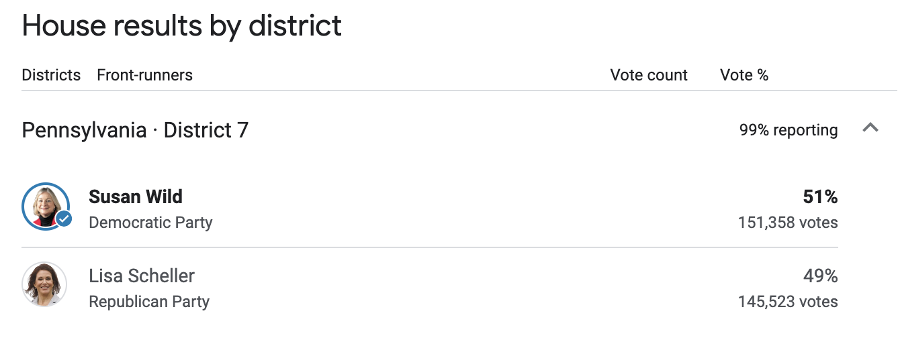
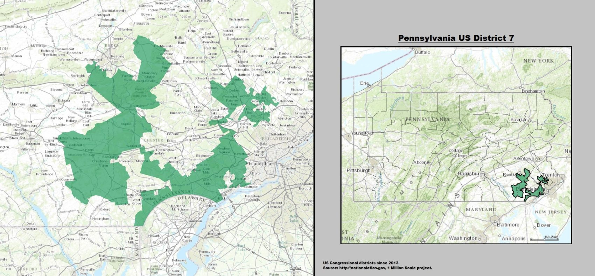
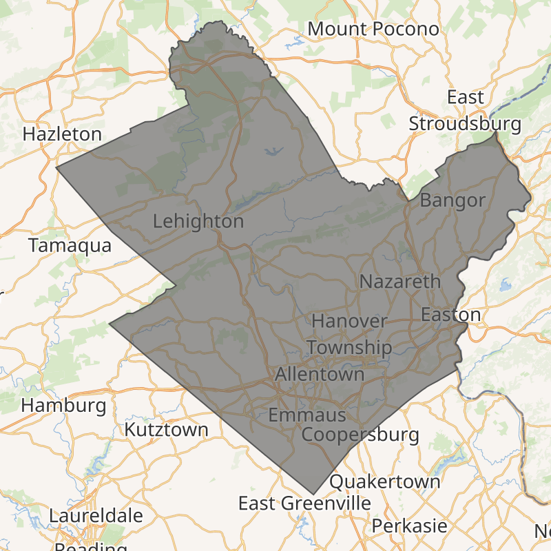

## Introduction of PA-07
This semester, I closely paid attention to the election happening in **Pennsylvania’s 7th Congressional District**, which featured a rematch between Democratic incumbent, **Susan Wild**, and Republican challenger, **Lisa Scheller**. In the end, Susan Wild won re-election with about 51% of the vote to Lisa Scheller’s 49%. There was a vote margin of less than 6,000 votes! 

### History of PA-07
Due to the 2020 Census, Pennsylvania lost a seat in reapportionment and had to redraw their maps, which went into effect on February 23, 2022. Included in this process was the redistricting of PA-07, which made the district even **more competitive**.  

In 2020, Joe Biden won PA-07 with 51.8% of the vote, compared to Donald Trump’s 47.0%. However, when [Daily Kos](https://www.dailykos.com/stories/2021/9/29/2055001/-Daily-Kos-Elections-2020-presidential-results-by-congressional-district-for-new-and-old-districts) calculated what the results of the 2020 presidential election would be based on the newly redistricted boundaries of PA-07, Biden would have received 49.7% of the vote in this district and Trump would have received 49.1%. Hence, the [2022 Cook Partisan Voter Index for PA-07](https://www.cookpolitical.com/cook-pvi/2022-partisan-voting-index) was R+2, which means that in the previous two presidential elections, this district’s results were 2 percentage points more Republican than the national average. 

**In short, the redistricting of PA-07 did NOT benefit Democratic incumbent, Susan Wild.** As a result, some pundits believed that either Wild would have an extremely difficult time winning re-election or would even lose. 

In fact, PA-07 has an incredible history with redistricting. From 2013-2018, PA-07 was known as one of the most “egregious examples of gerrymandering” and its geographic shape was described as “Goofy kicking Donald Duck.” See below for the map.

Since 2011, PA-07 was represented by Republican Pat Meehan until he resigned on April 27, 2018 amid a sexual harassment case. Right before his resignation, the Supreme Court of Pennsylvania ruled that the district map violated the state constitution and thus redistricting began. Most of the old 7th district (including my hometown of Havertown, Pennsylvania) became the new 5th district and most of the old 15th district became the new 7th district. 

Thus, from 2018-2019, Pennsylvania’s 7th congressional district technically had 3 different representatives. First, it was Republican Pat Meehan who then resigned in April 2018 amid a sexual harassment case. Next, it was Democrat Mary Gay Scanlon who won the special election to serve the remainder of Meehan’s time in the pre-2018-redistricted version of PA-07. Then, during the 2018 midterm elections and after redistricting, Democrat Susan Wild won the election of the new 7th district, while Mary Gay Scanlon won the election of the new 5th district (where I live!). 

Since being first elected in 2018, Susan Wild has won re-election twice in 2020 and now 2022. In both the 2020 and 2022 elections, Susan Wild was up against and beat Lisa Scheller. 

### The 2022 version of PA-07
The current 2022 version of PA-07 includes three full counties, Carbon, Lehigh, and Northampton, and small parts of Monroe County. Lehigh and Northampton counties are more blue-leaning, while Carbon County is more red-leaning, thus the addition of Carbon County into PA-07 through redistricting made some pundits fear for Susan Wild. 

The congressional district is about 70% white, 7.4% Black, 3.5% Asian, and 20.3% Hispanic. The median income in the district is $68,784. 

## Predictions vs Actual Results of PA-07
### How close was my prediction for PA-07?
My personal forecast for PA-07 predicted that the Democratic two-party vote share would be 50.1%, which indicated a Democratic victory. The actual result was indeed a Democratic victory and Susan Wild won about 51% of the vote.

This means that I accurately predicted a Democratic victory and **my Democratic vote-share prediction was only 0.9 percentage points off from the actual results in PA-07**!

### How close were the pundits?
Polling from [Muhlenberg College/Morning Call](https://www.muhlenberg.edu/aboutus/polling/politicselectionssurveys/archivedpolls/2022-pennsylvania7thdistrictpoll/) found Wild and Scheller locked in a statistical dead heat (47%-46%). [Politico](https://www.politico.com/2022-election/race-forecasts-ratings-and-predictions/pennsylvania/house/district-07/) had PA-07 as a toss-up. [Cook Political Report](https://www.cookpolitical.com/ratings/house-race-ratings) rated PA-07 as Democrat Toss Up. [FiveThirtyEight](https://projects.fivethirtyeight.com/2022-election-forecast/house/pennsylvania/7/) had Scheller slightly favored to win PA-07. [Larry Sabato’s Crystal Ball’s](https://centerforpolitics.org/crystalball/articles/final-ratings-for-the-2022-election/) final rating for PA-07 was Leans Republican. 

To sum it up, the only clear verdict for PA-07 was that it was going to be a very close election with both possibilities of a Wild or Scheller victory. 

## Evaluation of the Wild and Scheller campaigns
I think the overall consensus was that Wild ran a better campaign than Scheller. 

For example, [Wild outraised Scheller in campaign donations](https://www.penncapital-star.com/election-2022/in-the-lehigh-valleys-7th-district-democrat-wild-rakes-in-cash-republican-scheller-spends-on-ads/). For example, in October, Wild had 1.5 million dollars in cash on hand, which was nearly three times that of Scheller’s. However, Scheller did vastly outspend Wild in advertising over the last three months (1.15 million dollars to 343,260 dollars), but I don’t think it had that much of an effect. This could contribute to literature that says the air war has “rapid decay of advertising effects” in which “televised ads have strong but short-lived effects on voting preferences” (Gerber et al., 2011).

In addition, Wild benefited from candidate quality, while Scheller necessarily didn’t. In the same [Muhlenberg College/Morning Call poll](https://www.muhlenberg.edu/aboutus/polling/politicselectionssurveys/archivedpolls/2022-pennsylvania7thdistrictpoll/) from above, the pollsters found that 43% of people were “favorable” towards Wild, while 43% of people were “unfavorable” towards Scheller, which is a 10 point difference. One reason for Scheller’s unpopularity could be because of her role as CEO of Silberline Manufacturing, based in Schuylkill County. [Northampton County Executive Lamont McClure](https://www.penncapital-star.com/campaigns-elections/once-on-the-bubble-how-democratic-u-s-rep-susan-wild-won-re-election/), a Democrat, said about Scheller, “Not only that she closed plants here, but that she’s building new plants in China. While it’s absolutely true that China is our biggest geopolitical rival, the Republican Party has also made China its chief boogeyman. In this case, it meant that Scheller was out of step with their own base.”

Finally, Wild ran a strong ground game and benefited from being the incumbent. According to the [Pennsylvania Capital-Star](https://www.penncapital-star.com/campaigns-elections/once-on-the-bubble-how-democratic-u-s-rep-susan-wild-won-re-election/), “Democrats also reversed a trend that saw them losing voters while watching Republican post gains in voter registration in the district.” Wild’s campaign worked with voting rights organizations, like the New Pennsylvania Project, to register voters, especially young voters on Lehigh and Northampton community college campuses, and get them out to vote through traditional door-to-door canvassing. When canvassing, the Democratic volunteers “made a point to spread the message that Wild and Democrats passed significant legislation, such as the Inflation Reduction Act, which among other things will allow Medicare to negotiate lower prices for certain medications; the CHIPS Act to jumpstart U.S. semiconductor production; and medical care for veterans exposed to toxic burn pits.” This was to highlight Wild’s work as the incumbent representative. 

## How did the campaign or candidate contribute to deviations from the forecasted outcomes?
Two features of the Wild campaign immediately come to mind. 

First, I think predictions, including mine, were unsure of how strong the “abortion effect” was going to be, let alone how to quantify it. The Dobbs decision was a political “shock” but many pundits were unsure if its effect would last until election day. For example, literature says that there are cases when voters irrationally consider the impact of shocks in their vote. Researchers found the effect of partisan bias. When asked which official was to be blamed for September 11, the answer depended on partisanship (Malhotra and Kuo 2008; Healy, Kuo, Malhotra 2014). Thus, I was unsure of how to account for the abortion effect and ended up not doing so. 

However, Wild had a huge advantage among female voters (58% to Scheller’s 37%). The [Pennsylvania Capital-Star](https://www.penncapital-star.com/campaigns-elections/once-on-the-bubble-how-democratic-u-s-rep-susan-wild-won-re-election/) even said, “as a strong pro-choice advocate, Wild benefited from the backlash to the Supreme Court’s decision to overturn the 50-year precedent of Roe v Wade that gave women a constitutional right to an abortion.” In short, Wild was able to ride the abortion wave and turn out especially angry, suburban women who helped deliver her victory.

Speaking of turning out voters, I think predictions were also unable to account for voter turnout of certain populations, like young people. Ultimately, I think Wild had a stronger ground game that helped push her to victory. She focused on turning out her supporters, which is one thing that campaigns are very good at and can change election results. Campaigns have the potential to increase voter turnout by ~8% point (ex. 2012) “Modern campaigns can significantly alter the size and composition of the voting population” and “... most of our estimated effect is explained by ground campaigning, that is, individual voter contact through door-to-door canvassing, phone calls, and direct mail” (Enos & Fowler, 2016). The Wild campaign focused on increasing youth voter turnout, which I believe helped them because nationwide youth voters [supported Democratic House candidates by a wide margin: 62% to 35%](https://circle.tufts.edu/latest-research/millions-youth-cast-ballots-decide-key-2022-races). 

## Conclusion
Despite uncertainty about her race and redistricting, Susan Wild played into her strong points (candidate quality, abortion, incumbency, ground game) and won re-election once again! 

Sources:
- [Daily Kos, 2021](https://www.dailykos.com/stories/2021/9/29/2055001/-Daily-Kos-Elections-2020-presidential-results-by-congressional-district-for-new-and-old-districts)
- [Cook Political Report, 2022](https://www.cookpolitical.com/cook-pvi/2022-partisan-voting-index)
- [Muhlenberg College, 2022](https://www.muhlenberg.edu/aboutus/polling/politicselectionssurveys/archivedpolls/2022-pennsylvania7thdistrictpoll/)
- [Politico, 2022](https://www.politico.com/2022-election/race-forecasts-ratings-and-predictions/pennsylvania/house/district-07/)
- [FiveThirtyEight, 2022](https://projects.fivethirtyeight.com/2022-election-forecast/house/pennsylvania/7/)
- [Larry Sabato’s Crystal Ball, 2022](https://centerforpolitics.org/crystalball/articles/final-ratings-for-the-2022-election/)
- [Pennsylvania Capital-Star, October 2022](https://www.penncapital-star.com/election-2022/in-the-lehigh-valleys-7th-district-democrat-wild-rakes-in-cash-republican-scheller-spends-on-ads/)
- [Pennsylvania Capital-Star, November 2022](https://www.penncapital-star.com/campaigns-elections/once-on-the-bubble-how-democratic-u-s-rep-susan-wild-won-re-election/)
- [CIRCLE, 2022](https://circle.tufts.edu/latest-research/millions-youth-cast-ballots-decide-key-2022-races)
- [Pennsylvania Powered, 2022](https://capitolconnect.substack.com/p/pa-7-postmortem?sd=pf)

